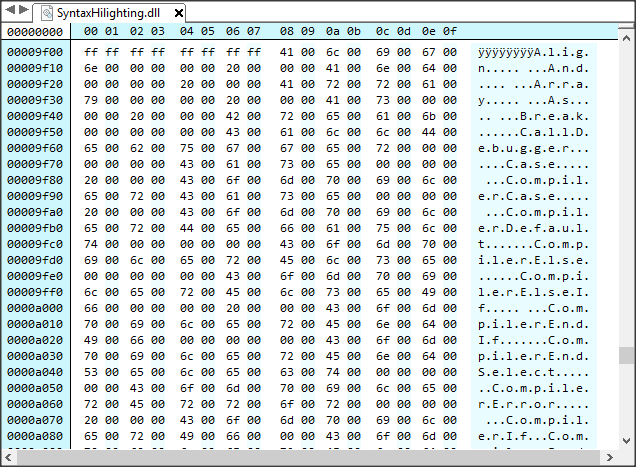

PureBASIC Tokens List
=====================

This document discusses the PureBASIC language tokens list in relation to syntax highlighters and code editors lang definitions: were to find the tokens list, how to manage and update it with different releases of the language, etc.

------------------------------------------------------------------------

<!-- #toc -->
-   [Introduction](#introduction)
    -   [Commands Index](#commands-index)
        -   [Commands Index Parser](#commands-index-parser)
    -   [The SDK’s Syntax Highlighter](#the-sdks-syntax-highlighter)
-   [Accessing Resources Within The Installer](#accessing-resources-within-the-installer)

<!-- /toc -->

------------------------------------------------------------------------

Introduction
============

Creation and maintainance of PureBASIC language syntax definitons will require having access to the full list of the language’s tokens. Unfortunately the task at hand is not that simple: PureBASIC doesn’t provide a list these tokens in a usable format. Furthermore, it will be necessary to track changes in this list with each new release of the language (new toknes, renaming, and deprecation).

The possible sources for these tokens are:

-   The documentation’s [Commands Index](http://www.purebasic.com/documentation/) page. (_WIP_)
-   The SDK’s syntax highlighter shared library. (_WIP_)
-   Invoking the compiler with special options. (_coming soon_)

Commands Index
--------------

The [Commands Index](http://www.purebasic.com/documentation/) page in the documentation — available both online (latest version only) as well as in PureBASIC installation — is an html document containing the list of all the command supported by any given version of PureBASIC, including commands that are OS specific.

Unfortunately, the online version of the documentation is available only for the latest release of PureBASIC, therefore other sources are needed to access previous versions of the file in order to build a version annoted list of these commands.

Older versions of this file can be taken from a PureBASIC installation ([or directly from the installer](#accessing-resources-within-the-installer)). On Windows, the html page will be inside the CHM Help file that is part of the installation, and will need to be extracted (CHM files can be unpacked like a ZIP file). On Mac, the documentation ships as loose html files, so no unpacking is required. On Linux the documentation is not in html.

### Commands Index Parser

User Marc56us has created a useful code base for extracting the list of commands from the online Commands Index documentation page:

-   [`Commands-Index-Parser.pb`](./Commands-Index-Parser.pb)

This code can easily be adapted to become part of a tokens extractor application.

The SDK’s Syntax Highlighter
----------------------------

PureBASIC for Windows comes with a syntax highlighter library in the SDK:

-   `\SDK\Syntax Highlighting\SyntaxHilighting.dll`

The DLL contains the keywords list of the language version it ships with. So (theoretically) it should be an up-to-date list reflecting the state of the syntax of any given version. I said “theoretically” because the SDK is in a pretty bad state, its documentation still refers to the Amiga in some places, and some sources therin are broken because they haven’t been updated for ages (see [PB Forum \#66969](http://www.purebasic.fr/english/viewtopic.php?f=3&t=66969)).

Since the DLL is in binary format, you’ll need and hex editor to peek inside it, and then work out a way of extracting the list. Also, the strings from version 5.50 onward are in Unicode format (UCS2 LE), before that they are in Ascii — any automated approach to extracting the strings must bare this in mind.

This is a screenshot of the contents of the `SyntaxHilighting.dll` that ships with PureBASIC 5.43, from [Hex Editor Neo](https://www.hhdsoftware.com/hex-editor):

And this is a screenshot of `SyntaxHilighting.dll` that ships with PureBASIC 5.50:

… you can clearly see the difference between the Ascii and Unicode strings.

*…to be continued…*

Accessing Resources Within The Installer
========================================

To avoid having to install each version of PureBASIC in order to access the above mentioned resources, the only workaround is to extract the contents of the binary installers, without actually installing anything.

The Linux installer is just a GZIP Compressed Tar Archive file (`*.tgz`), so you can unpack it with 7-Zip.

The Mac installer comes as an Apple Disk Image file (`*.dmg`), and it can be unpacked using 7-Zip too.

-   [www.7-Zip.org](http://www.7-zip.org/)

The Windows installer is a binary installer created with [Inno Setup](http://www.jrsoftware.org/isinfo.php) and it can’t be unpacked with ordinary compression tools like WinZip, 7-Zip and WinRAR.

You’ll need a free tool called **Universal Extractor**, an unpacker that supports a variaty of compression and isntaller formats, included the one used by the PureBASIC installer:

-   <https://www.legroom.net/software/uniextract>

